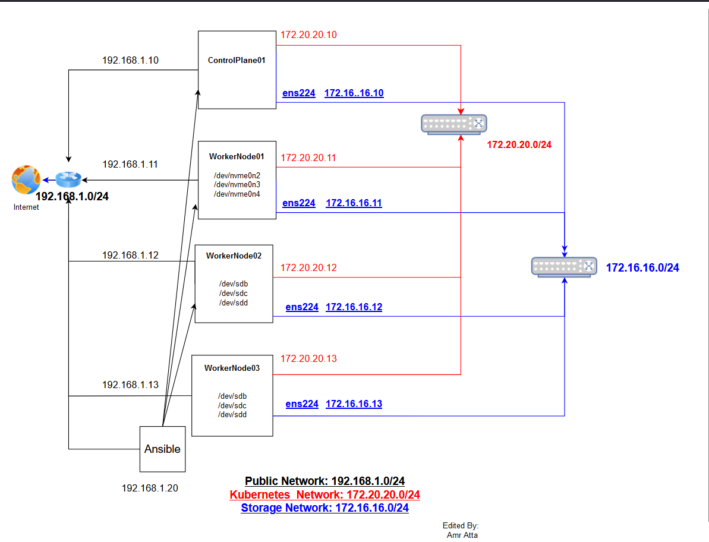
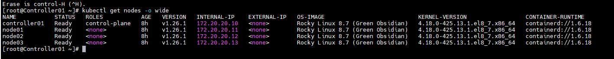
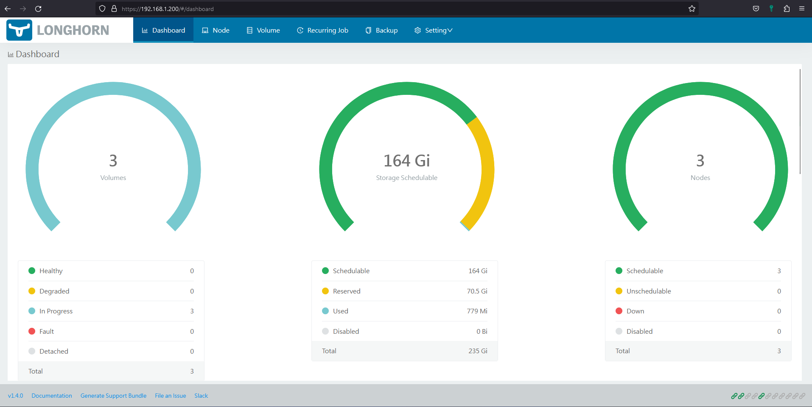

# k8s-cluster-setup.yml
This playbook will install multinode kubernete cluster, one control-plane node and multi worker nodes with containerd, helm, longhorn, multus,and MetalLB on RockyLinux (8.x,9.x) 
Recommended Rocky Linux 8.x 

 Please refer to the minimum requirements before beginning.
```
https://kubernetes.io/docs/setup/production-environment/tools/kubeadm/install-kubeadm/
```
```ini
https://longhorn.io/docs/1.4.0/best-practices/
```
## Cluster Nodes Requrements (Best Practice)
- One control plane node, At least 3 worker nodes ( to get longhorn disks in healthy state 3 worker nodes is required ) with Kubernetes and longhorn minimum requirements
- Root Access 
- Internet access 
- A dedicated network for internal kubernetes communication (kubernetes propagation network) is highly recommended for best practice.    
- A dedicated network for longhorn block storage  is highly recommended if not set longhorn storage will use the same kubernets network.
    * The NIC name attached to the storage network must be with the same name on all nodes.   
- A dedicated disk for Longhorn storage , instead of using the root disk. [Longhorn best practices](https://longhorn.io/docs/1.4.0/best-practices/)
   * Blcok devices Ex(/dev/sdb, /dev/sdd,/dev/sdc ) will be used to create lvm volume and mount it to /var/lib/longhorn if set_network_storage: true
    
 
 ## Quick Start
 you can see example for quick startup 
  * [example](https://github.com/amratta/rockylinux-multinode-k8s-setup#example)   
  * [example video](https://www.youtube.com/watch?v=tDvwGp0CRQs) 

## Ansible Setup & Configuration 
ansible core installed rocky linux 8.x  
use the following commands as root
```ini 
yum install ansible-core.x86_64 git python38-pip.noarch vim -y 
pip3.8 install netaddr
ansible-galaxy collection install ansible.netcommon community.general kubernetes.core community.crypto
```
## Clone Git Repo
 * Note:  in this document, I assume you have a fresh ansible server 
clone repo to /etc/ansible
```ini
rm -vrf /etc/ansible/*
git clone https://github.com/amratta/rockylinux-multinode-k8s-setup.git /etc/ansible
```

Note If you want to avoid ssh host key checking in /etc/ansible/ansible.cfg file change host_key_checking to False as the following 
change value to False 
```ini
vim /etc/ansible/ansible.cfg 
host_key_checking=False
```
edit ansible inventory file 

```
Very Importanat don't change group names ( all, control_nodes, worker_nodes )
```

```
cd /etc/ansible
vim hosts 
```
### ansible inventory file 
edit ansible inventory file to match your setup layout  
 
```ini 
[all:children]
control_nodes
worker_nodes

[control_nodes]
ControlPlane-01 ansible_host=IP ansible_user=root ansible_ssh_pass='Password' ansible_connection=ssh

[worker_nodes]
Node01 ansible_host=IP ansible_user=root ansible_ssh_pass='Password' ansible_connection=ssh  #lvm_pvs_devices='["/dev/sdb","/dev/sdc","/dev/sdd"]'
Node02 ansible_host=IP ansible_user=root ansible_ssh_pass='Password' ansible_connection=ssh  #lvm_pvs_devices='["/dev/sdb","/dev/sdc","/dev/sdd"]'
Node03 ansible_host=IP ansible_user=root ansible_ssh_pass='Password' ansible_connection=ssh  #lvm_pvs_devices='["/dev/sdb","/dev/sdc","/dev/sdd"]'
Node04 ansible_host=IP ansible_user=root ansible_ssh_pass='Password' ansible_connection=ssh  #lvm_pvs_devices='["/dev/sdb","/dev/sdc","/dev/sdd"]'


#[control_nodes:vars]
#ansible_connection=ssh
#ansible_user=root
#ansible_ssh_pass='password'
#ansible_ssh_private_key_file=/root/.ssh/id_rsa
#ansible_become=yes
#ansible_become_user=root
#ansible_become_method=sudo


#[worker_nodes:vars]
#ansible_connection=ssh
#ansible_user=root
#ansible_ssh_pass='password'


```

#### Edit vars.yml file 

```ini
vim /etc/ansible/playbooks/vars.yml
```
These is the most general variables you will need in installation for more options please check [Cluster variables](https://github.com/amratta/rockylinux-multinode-k8s-setup#cluster-variables)

```
 - dockerhub_auth: true/false
 - dockerhub_token: "docker_auth_token"
 - bootstrap_only: false


 - TimeZone: "TimeZone"
 - use_k8s_network: true/false       
 - k8s_internal_network: "kubernets propagtion network"

 - k8s_user_admin: "user_to_admin_kubernetes"
 - k8s_user_pass: "kubernets user password"

 - longhorn_ui_user: "longhorn_admin_panle_user"
 - longhorn_ui_password: "longhorn_admin_password"
 - set_network_storage: true/false

 - storage_nic:  "storage_network_NIC_name"   <-- must be the same name on all nodes connected to storage network 
 - create_dedicated_lvm_disk: true/false
 - data_path_fstype: "xfs/ext4"
 - lvm_pvs_devices:         <-- use this list method  if dedicated storage harddisks is the same  on all worker nodes, if not please define dedicatd ddisk   
       - "/dev/sdb"         <-- device in inventory file E.g   lvm_pvs_devices='["/dev/sdb","/dev/sdc","/dev/sdd"]'
       - "/dev/sdc"
       - "/dev/sdd"

 - MetaLB_Pool_Name: "public"
 - MetaLB_IP_Pool:
    - "StartIP-EndIP"
    #- "Public_Subnet"
     
```


#### Run playbook

```ini
cd /etc/ansible/playbooks
ansible-playbook k8s-cluster-setup.yml
``` 

### verify installation 
After the playbook is completed successfully, In control-plane node use  kubectl to check deployment, statfulset, services and pvc using the following commands


```ini
kubectl get nodes -o wide 
kubectl get deployments
kubectl get sts
kubectl get pvc
kubectl get svc
kubectl get ingress
```
point your browser into  svc  loadbalancer External IPs, you will get these messages 

```ini
For statefullset you will get ->  get I'm a StatefullSet pod my IP is IP
For deployment   you will get -> get I'm a Deployment Pod my IP is 
```
## Example 
All nodes with fresh installed  Rocky8.x, Playbook also tested for Rocky Linux 9.x and work fine 
### Cluster Layout 

### Network 
 In this setup we have three networks ( Public, Cluster, Storage)
 * Public Network (default): 192.1698.1.0/24 default network that anyone can access from the web browser   
 * Kubernets Cluster: 172.20.20.0/24 kubernetes cluster components communications network 
 * Storage Network: Longhorn Storage communication network  (All NIC interfaces connected to this network must be with the same name Ex. in our cluster ens224 on all nodes )  
### Cluster Nodes
#### ControlPlane01
* Role: Control Plane Node 
* Specs:
  * Harddisk 
     * root (/) file system with 30GB disk size
     * swap disk (will be removed from fstab during installation )
  * Network 
    * default network: 
      * ens160 connected to default public network with 192.168.1.10.
    * Cluster network:  
      * ens192 connected to cluster network with ip address 172.20.20.10
    * Storage Network: 
      * ens224: connected to Storage Network 172.16.16.10 <-- ethernet NIC connected to storage network must be with the same name on all nodes
#### Node01: 
* Role: Worker node
* Specs:
  * Harddisk 
     * root (/) file system with 15GB disk size
     * swap disk ( will be removed from fstab during installation )  
     * Longhorn dedicated storage disks
       * /dev/nvme0n2    
       * /dev/nvme0n3    
       * /dev/nvme0n4
  * Network 
    * default network: 
      * ens160 connected to default public network with 192.168.1.11.
    * Cluster network:  
      * ens192 connected to cluster network with ip address 172.20.20.11.
    * Storage Network: 
      * ens224: connected to Storage Network 172.16.16.11  <-- ethernet NIC connected to storage network must be with the same name on all nodes
#### Node02
* Role: Worker node
* Specs:
  * Harddisk 
     * root (/) file system with 15GB size 
     * swap disk (will be removed from fstab during installation )
     * Longhorn dedicated storage disks      
       * /dev/sdb     
       * /dev/sdc     
       * /dev/sdd
 * Network 
    * default network: 
      * ens160 connected to default public network with 192.168.1.12
    * Cluster network   
      * ens192 connected to cluster network with ip address 172.20.20.12
    * Storage Network:
      * ens224: connected to Storage Network 172.16.16.12  <-- ethernet NIC connected to storage network must be with the same name on all nodes

#### Node03
* Role: Worker node
* Specs:
   * Harddisk 
     * root (/) file system with 15GB size 
     * swap disk (will be removed from fstab during installation )
     * Longhorn dedicated storage disks
       * /dev/sdb     
       * /dev/sdc     
       * /dev/sdd
   * Network 
     * default network: 
       * ens160 connected to default public network with 192.168.1.13.
     * Cluster network:  
       * ens192 connected to cluster network with ip address 172.20.20.13.
     * Storage Network: 
       * ens224: connected to Storage Network 172.16.16.13  <-- ethernet NIC connected to storage network must be with the same name on all nodes

### Ansible Node
* Rocky Linux 8.x with internet access and can ssh to cluster nodes.
* Network:
   * default network: 
      * ens160 connected to default public network with 192.168.1.20
#### [Install Ansible](https://github.com/amratta/rockylinux-multinode-k8s-setup/blob/master/README.md#ansible-setup--configuration) 
#### [Clone Repo](https://github.com/amratta/rockylinux-multinode-k8s-setup/blob/master/README.md#clone-git-repo)   
#### Edit inventory file 
```
vim /etc/ansible/hosts
```
```ini
[all:children]
control_nodes
worker_nodes

[control_nodes]
ControlPlane-01 ansible_host=192.168.1.10 ansible_user=root ansible_ssh_pass='Pass123' ansible_connection=ssh

[worker_nodes]
Node01 ansible_host=192.168.1.11 ansible_user=root ansible_ssh_pass='Pass123' ansible_connection=ssh  lvm_pvs_devices='["/dev/nvme0n2 ","/dev/nvme0n3","/dev/nvme0n4"]'
Node02 ansible_host=192.168.1.12 ansible_user=root ansible_ssh_pass='Pass123' ansible_connection=ssh  lvm_pvs_devices='["/dev/sdb","/dev/sdc","/dev/sdd"]'
Node03 ansible_host=192.168.1.13 ansible_user=root ansible_ssh_pass='Pass123' ansible_connection=ssh  lvm_pvs_devices='["/dev/sdb","/dev/sdc","/dev/sdd"]'

#[control_nodes:vars]
#ansible_connection=ssh
#ansible_user=root
#ansible_ssh_pass='password'
#ansible_ssh_private_key_file=/root/.ssh/id_rsa
#ansible_become=yes
#ansible_become_user=root
#ansible_become_method=sudo


#[worker_nodes:vars]
#ansible_connection=ssh
#ansible_user=root
#ansible_ssh_pass='password'
```
#### Edit vars.yml file 
```ini
vim /etc/ansible/playbooks/vars.yml
```
```init
 - dockerhub_auth: false
 - dockerhub_token: ""
 - bootstrap_only: false


 - TimeZone: "Africa/Cairo"
 - use_k8s_network: true
 - k8s_internal_network: "172.20.20.0/24"

 - k8s_user_admin: "clusteradmin"
 - k8s_user_pass: "k8s123"

 - longhorn_ui_user: "longhorn"
 - longhorn_ui_password: "longhorn123"

 - set_network_storage: true
 - storage_nic:  "ens224" 
 - create_dedicated_lvm_disk: true
 - data_path_fstype: "ext4"
 
 - MetaLB_Pool_Name: "public"
 - MetaLB_IP_Pool:
    - "192.168.1.200-192.168.1.250"
```
#### Run Playbook 
```
cd /etc/ansible/playbooks
ansible-playbook k8s-cluster-setup.yml
```
Wait till the playbook is completed without errors.

### Verify Installation 
After ansiblke playbook completed without errors ssh into controlplane node with root user or admin user defined in vars.yml and check ingress and sts and deploymnets 
* adminuser: clusteradmin
* password: k8s123
```
kubectl get nodes 
kubectl get deployments 
kubectl get sts 
kubectl get svc
```


Point your browser into External IPs, from command kubectl get svc output in our case will be 192.168.1.201,192.168.1.202
you will get 
```ini
For statefullset you will get ->  get I'm a StatefullSet pod my IP is IP
For deployment   you will get -> get I'm a Deployment Pod my IP is 
```

### Access Longhorn Admin panel 
```
kubectl get -n longhorn-system ingress
```
you will get IP, Refer to this IP and provide theuser name and password defined in vars.yml file 
* user: longhorn
* password: longhorn123


### Cluster variables 
variables defined in vars.yml as a separate file.
Playbook with roles have alot of variables but in general you need to define the following vars to met your layout and cluster setup 

#### Dcoker Authentication Config Variables

|     Name  |   Type |  Values | Description |
| --------- | ------ | ---------- | ------------ |
| dockerhub_auth | Boolean | true/false  | Default: false authenticate to docker hub default false, Please check docker pull limits |
| dockerhub_token | String | "AuthToken" | Docker hub auth token please refer to docker site, after login to docker usign docker login command token will be in file $HOME/.docker/config.json |
| bootstrap_only | Boolean |  true/false | Default: false use authentication during cluster installation only, if true and docker_atuh is true docker token will be removed from containred after installation |   


#### Kubernets Cluster Config Variables

| Name            |   Type  |      value     | Default/Description |
| -------------   | ------- | -------------- | ------------------- |
| k8s_user_admin  | String  | "admin" | Default: "admin" Kubernetes administrator username will be created on control-plane node default: admin | 
| k8s_user_pass   | String  | "Password" | Default: "Password" Kubernetes administrator password default: Password |
| use_k8s_network | Boolean |  true/false | Default: false  Use dedicated network for kubernetes service communication if set to false kubernetes  will use default  gateway network |
|k8s_internal_network| String | "network/cidr" | Default: "172.31.255.0/24" ,Kubernetes service dedicated network effective if  use_k8s_network is true |
| Pods_CIDR" | String | "10.10.0.0/16" | Default: "10.10.0.0/16" ,Pods Network CID |
|  domain_name | String | "k8s.local" | Default: "k8s.local"  , used in setting nodes hostnames,/etc/hosts and creating DNS records for pods and Services please refer to kubernets docs | 
|set_k8s_service_domain | Boolean | true/false | Default: false   ,If set to true kubernetes Pods and Services DNS records will be created with the domain defined in domain_name variable | 
| MetaLB_Pool_Name | String | "public" | default: "public"  MetaLB LoadBalancer IP Pool name  
| MetaLB_IP_Pool | List of Strings | "192.168.1.l00-192.168.1.250" | No default. public ip address you can reach from your PC for more info  refer to MetaLB web site |

#### Longhorn Config Variables 

| Name |   Type   |  value/default | Default/Description |
| --------- | -------- | -------------- | -------------- |
| set_network_storage | Boolean | true/false | If you need dedicated network for storage communication set it to true |                      |  
| storage_nic | String | "eth3" | Deafult: eth3  Network interface card connected to dedicated storage network must be the same on all nodes | 
| create_dedicated_lvm_disk | Boolean | false | Default: false Let ansible to create dedicated storage disks in lvm volume  please see longhorn best practice  |
| lvm_pvs_devices | list of strings | ["/dev/sdxx","/dev/sdyy"] | no default. List of physical disks to use in lvm you can specify it per host in ansible inventory file,,,  Effective when create_dedicated_lvm_disk: true | 
|data_path_fstype | String | "xfs/ext4" | Deafult: ext4 Dedicated storage disk format,,, Effective when create_dedicated_lvm_disk: true |  
| longhorn_ui_user | String | "admin" | Default: admin longhron web inetrafce username |
|longhorn_ui_password| String | "Password" | Default: Password, longhorn web inetrafce user password |


#### System Values 
|      Name           |   Type   |  value/default | Default/Description |
| ------------------  | -------- | -------------- | -------------------- |
|   TimeZone          |  String  |      "UTC"     | Default: "UTC", TimeZone |
|   NTP_Servers       |  String  | List of String | Default: ["0.pool.ntp.org","1.pool.ntp.org","2.pool.ntp.org","3.pool.ntp.org"] , NTP Servers List |    


#### Default URLs and System Values 
Cluster resources URL 
| Name                  |  Values                                                                                                   |
| --------------------- | ----------------------------------------------------------------------------------------------------------|
| Calico_Tigera_URL     | "https://raw.githubusercontent.com/projectcalico/calico/v3.25.1/manifests/tigera-operator.yaml"           |            
| Calico_Custom_Res_URL | "https://raw.githubusercontent.com/projectcalico/calico/v3.25.1/manifests/custom-resources.yaml"          |
| MetaLB_URL            | "https://raw.githubusercontent.com/metallb/metallb/v0.13.9/config/manifests/metallb-native.yaml"          | 
| Longhorn_URL          | "https://raw.githubusercontent.com/longhorn/longhorn/v1.4.1/deploy/longhorn.yaml"                         |
| LonghornRWX_URL       | "https://raw.githubusercontent.com/longhorn/longhorn/master/examples/rwx/storageclass-migratable.yaml"    |
| Multus_URL            | "https://github.com/k8snetworkplumbingwg/multus-cni.git"                                                  |
| Helm_URL              | "https://get.helm.sh/helm-v3.11.3-linux-amd64.tar.gz"                                                     |
| Nginx_Ingress_URL     | "https://kubernetes.github.io/ingress-nginx"                                                              |
| Docker_Registry:      | "registry-1.docker.io"                                                                                    | 


